# Sequence Diagrams

This document contains sequence diagrams for key workflows in the KPTEST system.

## Table of Contents

1. [Patient Registration with HIS Verification](#patient-registration-with-his-verification)
2. [Patient Assignment to Project](#patient-assignment-to-project)
3. [Sending a Message](#sending-a-message)
4. [Creating a Therapy Event](#creating-a-therapy-event)

---

## Patient Registration with HIS Verification

This diagram shows the complete patient registration flow including HIS (Hospital Information System) verification.

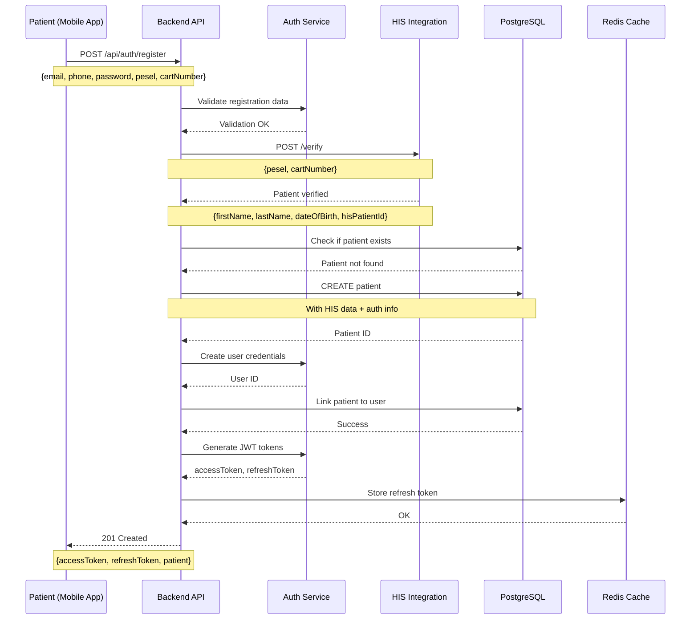
```mermaid
sequenceDiagram
    participant P as Patient (Mobile App)
    participant API as Backend API
    participant Auth as Auth Service
    participant HIS as HIS Integration
    participant DB as PostgreSQL
    participant Redis as Redis Cache

    P->>API: POST /api/auth/register
    Note over P,API: {email, phone, password, pesel, cartNumber}
    
    API->>Auth: Validate registration data
    Auth-->>API: Validation OK
    
    API->>HIS: POST /verify
    Note over API,HIS: {pesel, cartNumber}
    
    HIS-->>API: Patient verified
    Note over API,HIS: {firstName, lastName, dateOfBirth, hisPatientId}
    
    API->>DB: Check if patient exists
    DB-->>API: Patient not found
    
    API->>DB: CREATE patient
    Note over API,DB: With HIS data + auth info
    
    DB-->>API: Patient ID
    
    API->>Auth: Create user credentials
    Auth-->>API: User ID
    
    API->>DB: Link patient to user
    DB-->>API: Success
    
    API->>Auth: Generate JWT tokens
    Auth-->>API: accessToken, refreshToken
    
    API->>Redis: Store refresh token
    Redis-->>API: OK
    
    API-->>P: 201 Created
    Note over API,P: {accessToken, refreshToken, patient}
```

### Key Points

1. **HIS Verification**: Patient data is verified against the Hospital Information System using PESEL and cart number
2. **Data Flow**: Only basic demographic data is retrieved from HIS (no full medical records)
3. **Token Generation**: JWT tokens are generated upon successful registration
4. **Error Handling**: If HIS verification fails, registration is rejected

### Error Scenarios

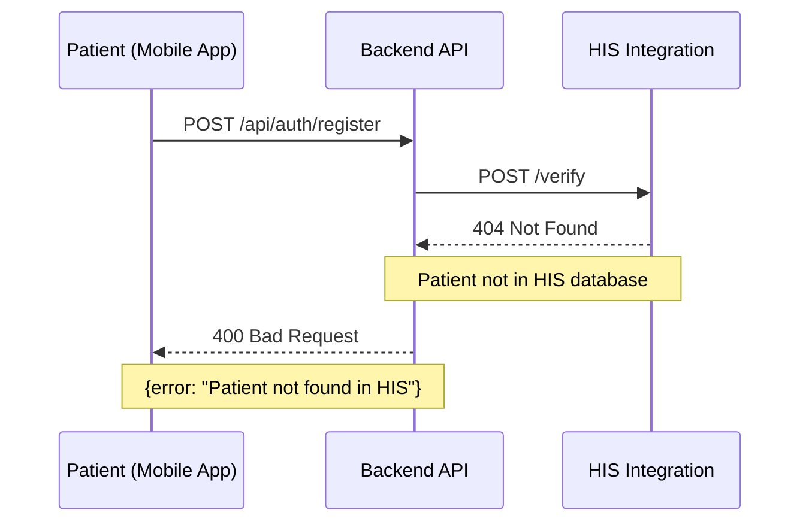
```mermaid
sequenceDiagram
    participant P as Patient (Mobile App)
    participant API as Backend API
    participant HIS as HIS Integration

    P->>API: POST /api/auth/register
    
    API->>HIS: POST /verify
    
    HIS-->>API: 404 Not Found
    Note over API,HIS: Patient not in HIS database
    
    API-->>P: 400 Bad Request
    Note over API,P: {error: "Patient not found in HIS"}
```

---

## Patient Assignment to Project

This diagram shows the workflow for assigning a patient to a therapeutic project.

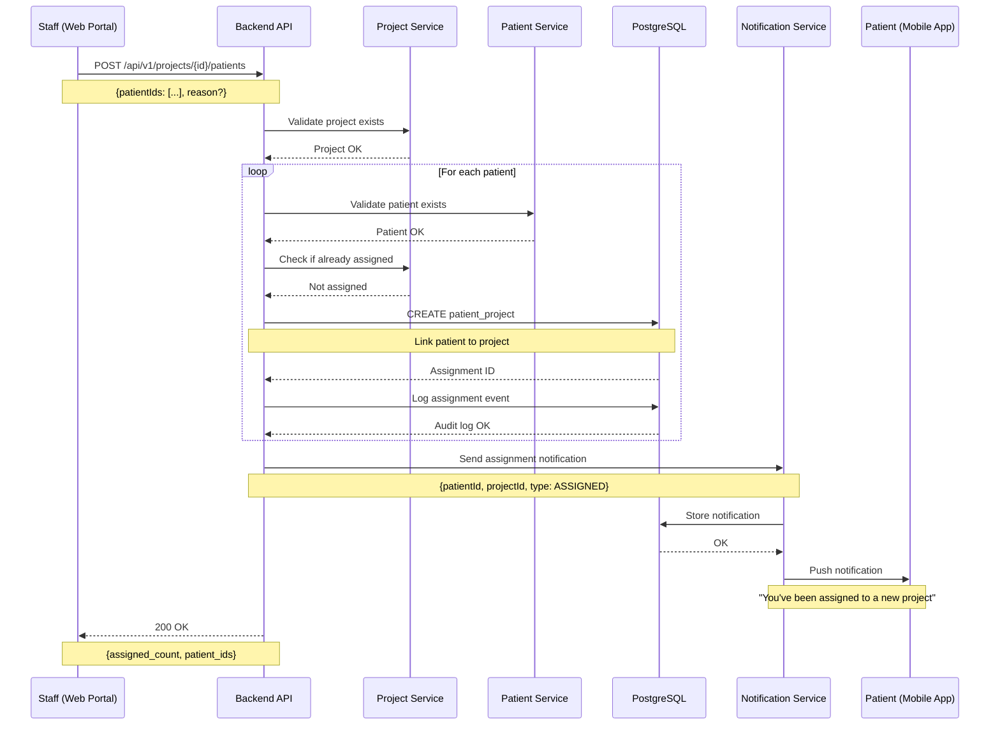
```mermaid
sequenceDiagram
    participant S as Staff (Web Portal)
    participant API as Backend API
    participant Proj as Project Service
    participant Patient as Patient Service
    participant DB as PostgreSQL
    participant Notify as Notification Service
    participant P as Patient (Mobile App)

    S->>API: POST /api/v1/projects/{id}/patients
    Note over S,API: {patientIds: [...], reason?}
    
    API->>Proj: Validate project exists
    Proj-->>API: Project OK
    
    loop For each patient
        API->>Patient: Validate patient exists
        Patient-->>API: Patient OK
        
        API->>Proj: Check if already assigned
        Proj-->>API: Not assigned
        
        API->>DB: CREATE patient_project
        Note over API,DB: Link patient to project
        DB-->>API: Assignment ID
        
        API->>DB: Log assignment event
        DB-->>API: Audit log OK
    end
    
    API->>Notify: Send assignment notification
    Note over API,Notify: {patientId, projectId, type: ASSIGNED}
    
    Notify->>DB: Store notification
    DB-->>Notify: OK
    
    Notify->>P: Push notification
    Note over Notify,P: "You've been assigned to a new project"
    
    API-->>S: 200 OK
    Note over API,S: {assigned_count, patient_ids}
```

### Key Points

1. **Batch Assignment**: Multiple patients can be assigned in a single request
2. **Validation**: Each patient is validated before assignment
3. **Audit Trail**: All assignments are logged for compliance
4. **Notification**: Patient receives immediate notification

### Removal Flow

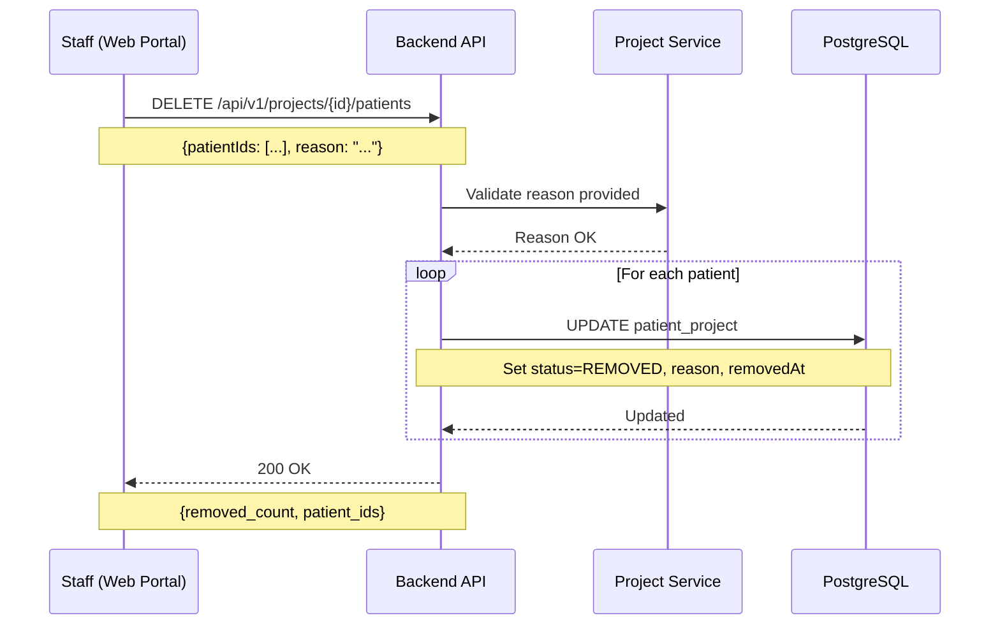
```mermaid
sequenceDiagram
    participant S as Staff (Web Portal)
    participant API as Backend API
    participant Proj as Project Service
    participant DB as PostgreSQL

    S->>API: DELETE /api/v1/projects/{id}/patients
    Note over S,API: {patientIds: [...], reason: "..."}
    
    API->>Proj: Validate reason provided
    Proj-->>API: Reason OK
    
    loop For each patient
        API->>DB: UPDATE patient_project
        Note over API,DB: Set status=REMOVED, reason, removedAt
        DB-->>API: Updated
    end
    
    API-->>S: 200 OK
    Note over API,S: {removed_count, patient_ids}
```

---

## Sending a Message

This diagram shows the complete messaging flow including thread management and notifications.

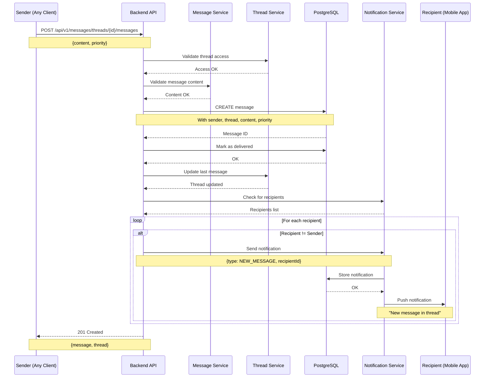
```mermaid
sequenceDiagram
    participant S as Sender (Any Client)
    participant API as Backend API
    participant Msg as Message Service
    participant Thread as Thread Service
    participant DB as PostgreSQL
    participant Notify as Notification Service
    participant R as Recipient (Mobile App)

    S->>API: POST /api/v1/messages/threads/{id}/messages
    Note over S,API: {content, priority}
    
    API->>Thread: Validate thread access
    Thread-->>API: Access OK
    
    API->>Msg: Validate message content
    Msg-->>API: Content OK
    
    API->>DB: CREATE message
    Note over API,DB: With sender, thread, content, priority
    DB-->>API: Message ID
    
    API->>DB: Mark as delivered
    DB-->>API: OK
    
    API->>Thread: Update last message
    Thread-->>API: Thread updated
    
    API->>Notify: Check for recipients
    Notify-->>API: Recipients list
    
    loop For each recipient
        alt Recipient != Sender
            API->>Notify: Send notification
            Note over API,Notify: {type: NEW_MESSAGE, recipientId}
            
            Notify->>DB: Store notification
            DB-->>Notify: OK
            
            Notify->>R: Push notification
            Note over Notify,R: "New message in thread"
        end
    end
    
    API-->>S: 201 Created
    Note over API,S: {message, thread}
```

### Message with Attachment

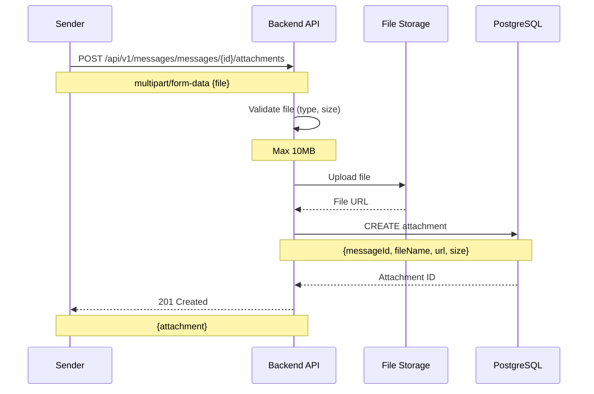
```mermaid
sequenceDiagram
    participant S as Sender
    participant API as Backend API
    participant Storage as File Storage
    participant DB as PostgreSQL

    S->>API: POST /api/v1/messages/messages/{id}/attachments
    Note over S,API: multipart/form-data {file}
    
    API->>API: Validate file (type, size)
    Note over API,API: Max 10MB
    
    API->>Storage: Upload file
    Storage-->>API: File URL
    
    API->>DB: CREATE attachment
    Note over API,DB: {messageId, fileName, url, size}
    DB-->>API: Attachment ID
    
    API-->>S: 201 Created
    Note over API,S: {attachment}
```

### Reading a Message

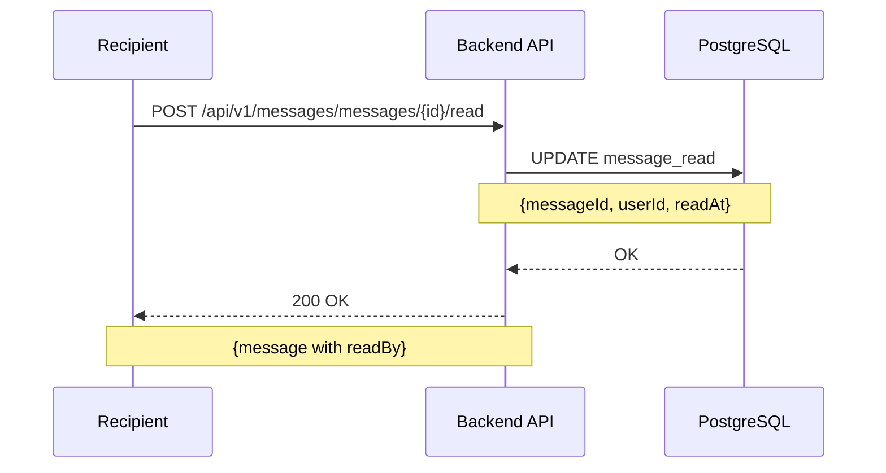
```mermaid
sequenceDiagram
    participant R as Recipient
    participant API as Backend API
    participant DB as PostgreSQL

    R->>API: POST /api/v1/messages/messages/{id}/read
    
    API->>DB: UPDATE message_read
    Note over API,DB: {messageId, userId, readAt}
    DB-->>API: OK
    
    API-->>R: 200 OK
    Note over API,R: {message with readBy}
```

---

## Creating a Therapy Event

This diagram shows the workflow for creating and scheduling therapy events with reminders.

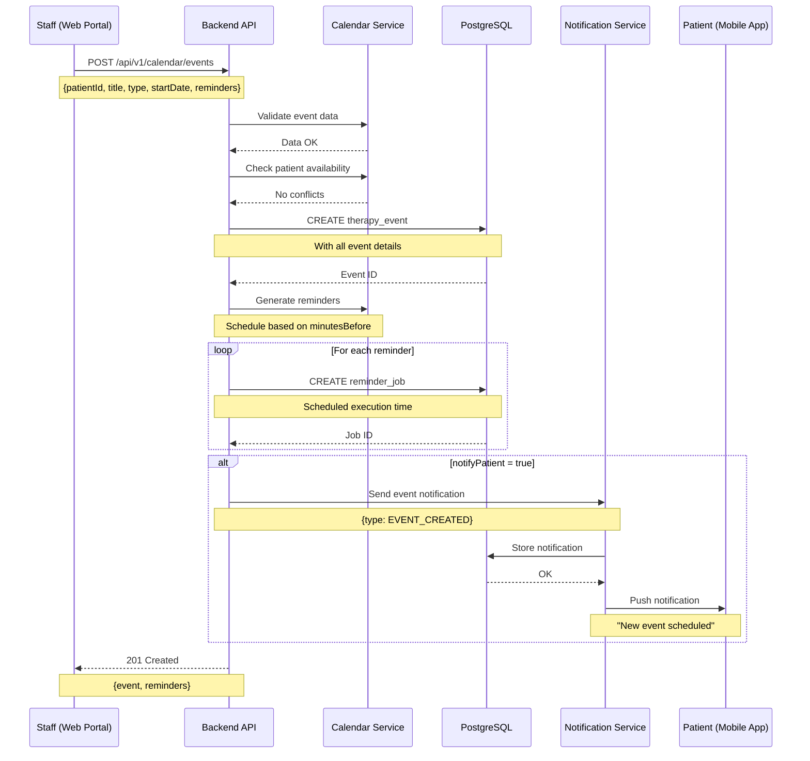
```mermaid
sequenceDiagram
    participant S as Staff (Web Portal)
    participant API as Backend API
    participant Cal as Calendar Service
    participant DB as PostgreSQL
    participant Notify as Notification Service
    participant P as Patient (Mobile App)

    S->>API: POST /api/v1/calendar/events
    Note over S,API: {patientId, title, type, startDate, reminders}
    
    API->>Cal: Validate event data
    Cal-->>API: Data OK
    
    API->>Cal: Check patient availability
    Cal-->>API: No conflicts
    
    API->>DB: CREATE therapy_event
    Note over API,DB: With all event details
    DB-->>API: Event ID
    
    API->>Cal: Generate reminders
    Note over API,Cal: Schedule based on minutesBefore
    
    loop For each reminder
        API->>DB: CREATE reminder_job
        Note over API,DB: Scheduled execution time
        DB-->>API: Job ID
    end
    
    alt notifyPatient = true
        API->>Notify: Send event notification
        Note over API,Notify: {type: EVENT_CREATED}
        
        Notify->>DB: Store notification
        DB-->>Notify: OK
        
        Notify->>P: Push notification
        Note over Notify,P: "New event scheduled"
    end
    
    API-->>S: 201 Created
    Note over API,S: {event, reminders}
```

### Recurring Event Creation

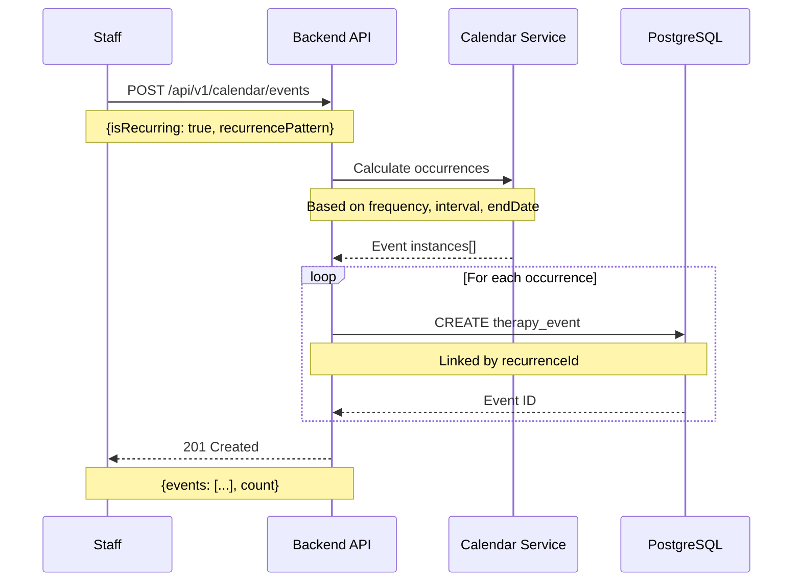
```mermaid
sequenceDiagram
    participant S as Staff
    participant API as Backend API
    participant Cal as Calendar Service
    participant DB as PostgreSQL

    S->>API: POST /api/v1/calendar/events
    Note over S,API: {isRecurring: true, recurrencePattern}
    
    API->>Cal: Calculate occurrences
    Note over API,Cal: Based on frequency, interval, endDate
    
    Cal-->>API: Event instances[]
    
    loop For each occurrence
        API->>DB: CREATE therapy_event
        Note over API,DB: Linked by recurrenceId
        DB-->>API: Event ID
    end
    
    API-->>S: 201 Created
    Note over API,S: {events: [...], count}
```

### Event Completion

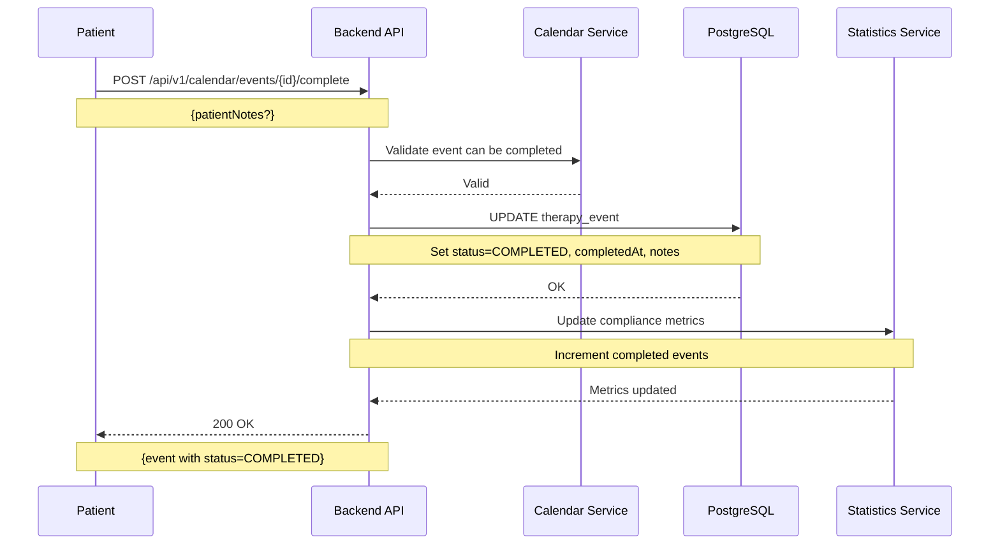
```mermaid
sequenceDiagram
    participant P as Patient
    participant API as Backend API
    participant Cal as Calendar Service
    participant DB as PostgreSQL
    participant Stats as Statistics Service

    P->>API: POST /api/v1/calendar/events/{id}/complete
    Note over P,API: {patientNotes?}
    
    API->>Cal: Validate event can be completed
    Cal-->>API: Valid
    
    API->>DB: UPDATE therapy_event
    Note over API,DB: Set status=COMPLETED, completedAt, notes
    DB-->>API: OK
    
    API->>Stats: Update compliance metrics
    Note over API,Stats: Increment completed events
    
    Stats-->>API: Metrics updated
    
    API-->>P: 200 OK
    Note over API,P: {event with status=COMPLETED}
```

---

## Integration Points

### HIS Integration

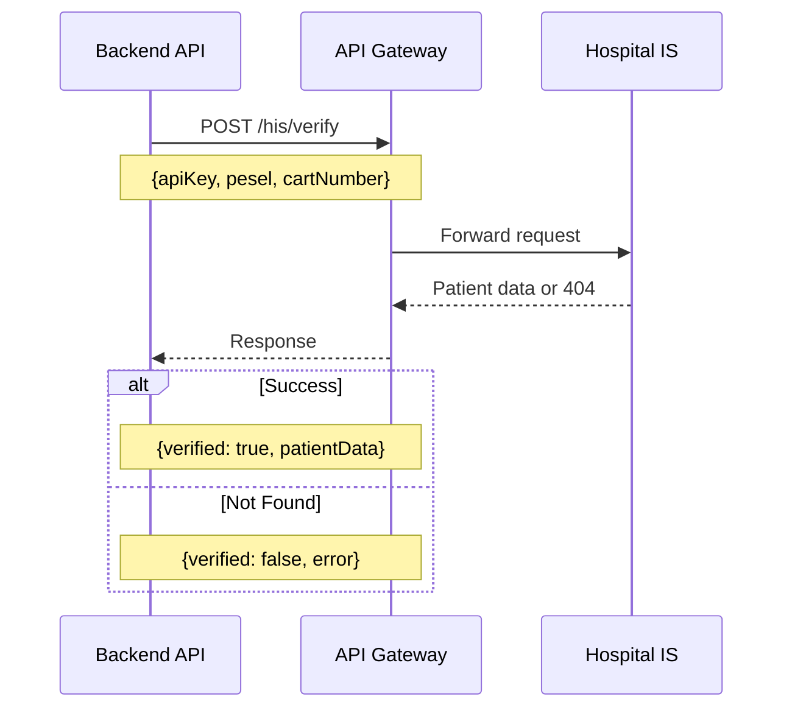
```mermaid
sequenceDiagram
    participant API as Backend API
    participant Gateway as API Gateway
    participant HIS as Hospital IS
    
    API->>Gateway: POST /his/verify
    Note over API,Gateway: {apiKey, pesel, cartNumber}
    
    Gateway->>HIS: Forward request
    HIS-->>Gateway: Patient data or 404
    
    Gateway-->>API: Response
    
    alt Success
        Note over API,Gateway: {verified: true, patientData}
    else Not Found
        Note over API,Gateway: {verified: false, error}
    end
```

### Push Notification Flow

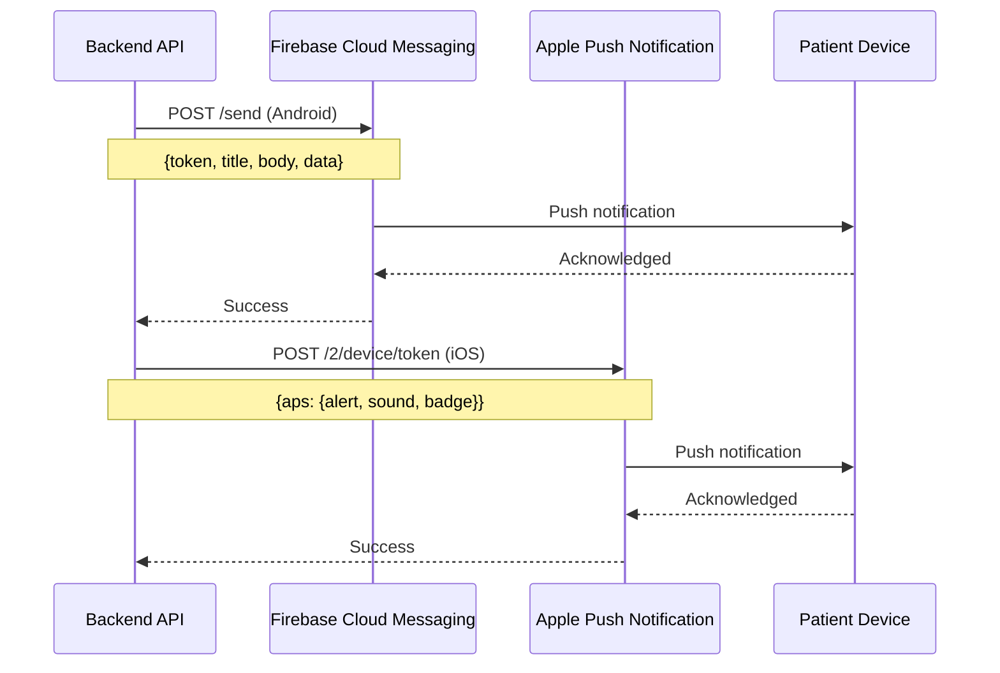
```mermaid
sequenceDiagram
    participant API as Backend API
    participant FCM as Firebase Cloud Messaging
    participant APNS as Apple Push Notification
    participant Device as Patient Device

    API->>FCM: POST /send (Android)
    Note over API,FCM: {token, title, body, data}
    
    FCM->>Device: Push notification
    Device-->>FCM: Acknowledged
    FCM-->>API: Success
    
    API->>APNS: POST /2/device/token (iOS)
    Note over API,APNS: {aps: {alert, sound, badge}}
    
    APNS->>Device: Push notification
    Device-->>APNS: Acknowledged
    APNS-->>API: Success
```

---

## Error Handling Patterns

### Retry Pattern for HIS Integration

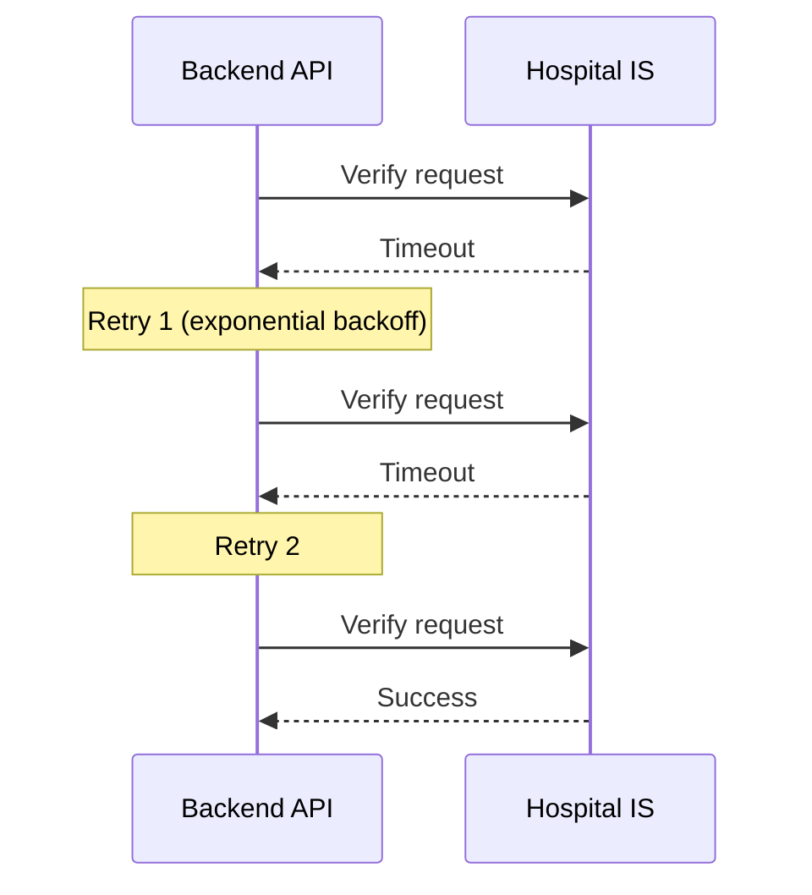
```mermaid
sequenceDiagram
    participant API as Backend API
    participant HIS as Hospital IS
    
    API->>HIS: Verify request
    HIS-->>API: Timeout
    
    Note over API: Retry 1 (exponential backoff)
    API->>HIS: Verify request
    HIS-->>API: Timeout
    
    Note over API: Retry 2
    API->>HIS: Verify request
    HIS-->>API: Success
```

### Circuit Breaker for External Services

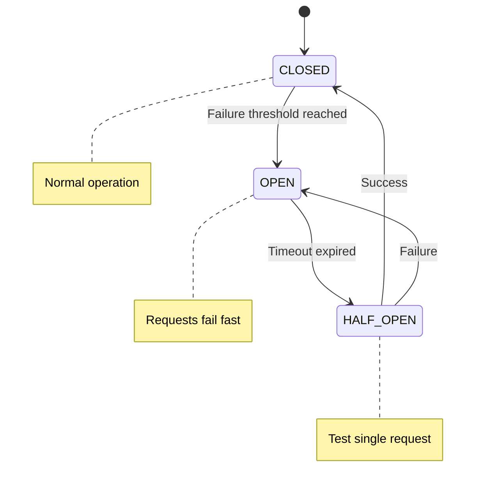
```mermaid
stateDiagram-v2
    [*] --> CLOSED
    
    CLOSED --> OPEN: Failure threshold reached
    OPEN --> HALF_OPEN: Timeout expired
    HALF_OPEN --> CLOSED: Success
    HALF_OPEN --> OPEN: Failure
    
    note right of CLOSED: Normal operation
    note right of OPEN: Requests fail fast
    note right of HALF_OPEN: Test single request
```

---

## Related Documentation

- [System Overview](./system-overview.md)
- [Data Model](./data-model.md)
- [API Documentation](../api/)
